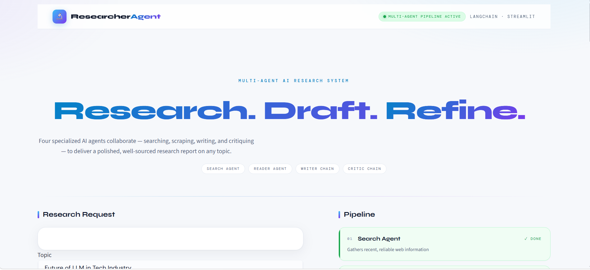
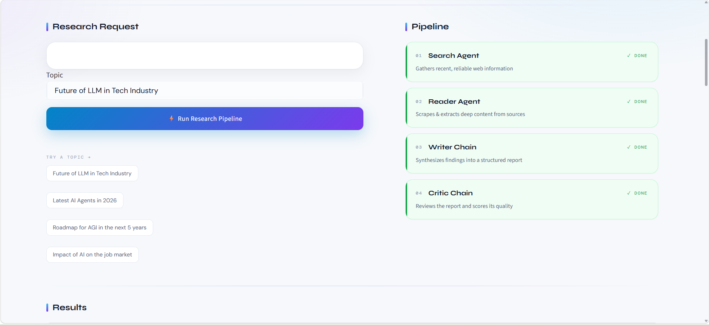
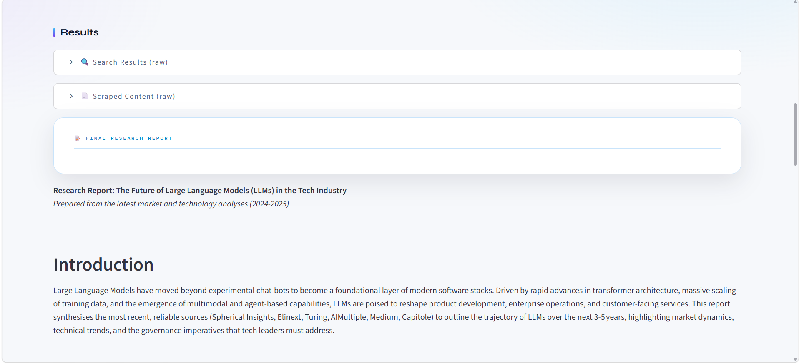

# LangChain Multi-Agent Research System

<p align="center">
  
  
  
  
  
</p>

<p align="center">
  An autonomous, multi-agent research system built with LangChain that searches the web, extracts deep content, writes structured reports, and evaluates its own output — end to end.
</p>

---

## Table of Contents

- [Overview](#overview)
- [Key Features](#key-features)
- [Architecture](#architecture)
- [Agent Responsibilities](#agent-responsibilities)
- [How It Works](#how-it-works)
- [Technologies](#technologies)
- [Prerequisites](#prerequisites)
- [Installation](#installation)
- [Configuration](#configuration)
- [Usage](#usage)
- [Screenshots](#screenshots)
- [Sample Outputs](#sample-outputs)
- [Project Structure](#project-structure)
- [Output](#output)
- [Roadmap](#roadmap)
- [Contributing](#contributing)
- [License](#license)
- [Acknowledgments](#acknowledgments)

---

## Overview

**LangChain Multi-Agent Research System** orchestrates four specialized AI components to produce polished, well-sourced research reports on any topic:

1. A **Search Agent** discovers relevant, up-to-date web results.
2. A **Reader Agent** scrapes and extracts clean, readable content from the most relevant sources.
3. A **Writer Chain** synthesizes the gathered research into a structured, professional report.
4. A **Critic Chain** reviews the report, assigns a quality score, and provides concrete improvement feedback.

The pipeline is exposed through two interfaces: an interactive, fully-styled **Streamlit web app** and a lightweight **CLI script**.

---

## Key Features

| Feature | Description |
|---------|-------------|
| 🤖 **Multi-Agent Orchestration** | Dedicated agents for searching, reading, writing, and critiquing, coordinated through a single pipeline |
| 🔍 **Automated Web Research** | Real-time web search powered by the Tavily API |
| 📄 **Resilient Content Extraction** | Three-tier scraping pipeline with graceful fallbacks (trafilatura → readability → raw HTML) |
| ✍️ **AI Report Generation** | Structured reports with introduction, key findings, conclusion, and cited sources |
| 🧐 **Self-Evaluation** | Built-in critic that scores reports from 1–10 and lists strengths and improvement areas |
| 🖥️ **Modern UI** | Clean light-mode Streamlit interface with live pipeline progress, animated step cards, and auto-extracted quality metrics |
| 📄 **PDF Export** | Download the final report as a formatted A4 PDF, or the full research bundle as JSON |
| 🧩 **Modular Design** | Clean separation between agents, tools, and pipelines for easy extension |

---

## Architecture

```
┌──────────────────────────────────────────────────────────┐
│                  Interfaces (app.py / main.py)           │
│            Streamlit UI  ·  CLI Entry Point              │
└──────────────────────────┬───────────────────────────────┘
                           │
┌──────────────────────────▼───────────────────────────────┐
│          Research Pipeline (pipeline.py)                 │
│          Sequential multi-agent orchestration            │
└──────────────────────────┬───────────────────────────────┘
                           │
      ┌────────────────────┼────────────────────┐
      │                    │                    │
┌─────▼─────┐       ┌──────▼──────┐      ┌──────▼─────┐
│  Search   │       │   Reader    │      │  Writer    │
│  Agent    │       │   Agent     │      │  Chain     │
└─────┬─────┘       └──────┬──────┘      └──────┬─────┘
      │                    │                    │
      │      ┌─────────────▼─────────────┐      │
      └─────▶│       Tools Layer        │◀─────┘
             │                          │
             │ • web_search (Tavily)    │
             │ • scrape_url (3-tier)    │
             └─────────────┬─────────────┘
                           │
                    ┌──────▼──────┐
                    │   Critic    │
                    │   Chain     │
                    └─────────────┘
```

---

## Agent Responsibilities

| Component | Responsibility |
|-----------|---------------|
| **Search Agent** | Queries the Tavily API for recent, reliable results (titles, URLs, snippets) on the given topic |
| **Reader Agent** | Selects the most relevant URL and extracts deep, readable content using a layered scraping strategy |
| **Writer Chain** | Transforms combined search + scraped content into a structured, professional research report |
| **Critic Chain** | Evaluates the report strictly — assigns a score out of 10, highlights strengths, and suggests improvements |

---

## How It Works

```
User Input → ① Search → ② Read → ③ Write → ④ Critique → Final Report + Feedback
```

1. **Input** — A research topic is provided via the UI or CLI.
2. **Search** — The Search Agent gathers recent, reliable sources from the web.
3. **Read** — The Reader Agent scrapes the most promising source for deeper content.
4. **Write** — The Writer Chain merges search results and scraped content into a structured report (Introduction · Key Findings · Conclusion · Sources).
5. **Critique** — The Critic Chain reviews the report, scoring it and suggesting concrete improvements.
6. **Output** — The final report, score, and feedback are rendered in the UI and available for download.

---

## Technologies

| Technology | Purpose |
|------------|---------|
| [LangChain](https://www.langchain.com/) | Agent creation and chain orchestration |
| [OpenRouter](https://openrouter.ai/) | Free LLM access for agents and chains (default: `openrouter/free` auto-router) |
| [Tavily](https://tavily.com/) | Web search and information retrieval |
| [Trafilatura](https://trafilatura.readthedocs.io/) | Primary article/blog content extraction |
| [Readability-lxml](https://pypi.org/project/readability-lxml/) | Secondary content extraction strategy |
| [BeautifulSoup4](https://www.crummy.com/software/BeautifulSoup/) | HTML parsing and fallback extraction |
| [Streamlit](https://streamlit.io/) | Interactive web application |
| [Markdown](https://python-markdown.github.io/) | Converts reports to HTML for PDF export |
| [xhtml2pdf](https://xhtml2pdf.readthedocs.io/) | Renders HTML reports to PDF |
| [python-dotenv](https://pypi.org/project/python-dotenv/) | Environment configuration management |
| [Rich](https://github.com/Textualize/rich) | Rich terminal output formatting |

---

## Prerequisites

- **Python 3.11 or higher**
- An **OpenRouter API Key** (free — sign up at [openrouter.ai](https://openrouter.ai), no credit card required)
- A **Tavily API Key** (web search)

---

## Installation

### 1. Clone the Repository

```bash
git clone https://github.com/yourusername/LangChain-Multi-Agent-Research-System.git
cd LangChain-Multi-Agent-Research-System
```

### 2. Create a Virtual Environment

**Option A — Conda:**

```bash
conda create -n langagent python=3.11 -y
conda activate langagent
```

**Option B — venv:**

```bash
python -m venv venv

# macOS / Linux
source venv/bin/activate

# Windows
venv\Scripts\activate
```

### 3. Install Dependencies

```bash
pip install -r requirements.txt
```

---

## Configuration

Create a `.env` file in the project root:

```bash
TAVILY_API_KEY=your_tavily_api_key_here
OPENROUTER_API_KEY=your_openrouter_api_key_here
OPENROUTER_MODEL=openrouter/free   # optional, defaults to OpenRouter's free auto-router
```

> **Security Note:** The `.env` file is already excluded via `.gitignore` and must **never** be committed to version control.

The LLM is configured in `src/agents/agents.py` with built-in retries (`max_retries=5`) to handle transient rate limits on OpenRouter free models. To pin a specific free model, set `OPENROUTER_MODEL` (e.g. `google/gemma-4-31b-it:free`).

Obtain your API keys here:

| Service | Where to get it | Cost |
|---------|-----------------|------|
| OpenRouter | https://openrouter.ai/settings/keys | Free (no credit card) |
| Tavily | https://tavily.com | Free tier available |

---

## Usage

### Option 1 — Streamlit Web UI (Recommended)

```bash
streamlit run app.py
```

Open [http://localhost:8501](http://localhost:8501) in your browser, enter a topic, and click **Run Research Pipeline**. The interface shows a live progress bar and animated step cards as each agent works, then renders the final report with quality metrics and download options (PDF or JSON).

### Option 2 — CLI Script

```bash
python main.py
```

Edit the `topic` variable in `main.py` to research a different subject. The pipeline logs each stage to the terminal with rich formatting.

---

## Screenshots

The web UI guides you through three stages:

<p align="center">
  
  <br/>
  <em>UI 1 — Main interface: research request input and pipeline overview</em>
</p>

<p align="center">
  
  <br/>
  <em>UI 2 — Live pipeline execution with animated progress loader and step status</em>
</p>

<p align="center">
  
  <br/>
  <em>UI 3 — Results: quality score metrics, final report, critic feedback, and download buttons</em>
</p>

---

## Sample Outputs

Example files produced by a real run are included in [`docs/samples`](docs/samples):

| File | Description |
|------|-------------|
| [sample-report.pdf](docs/samples/sample-report.pdf) | The final research report exported as a formatted PDF |
| [sample-bundle.json](docs/samples/sample-bundle.json) | The full research bundle — topic, search results, scraped content, report, and critic feedback |

---

## Project Structure

```
.
├── app.py                      # Streamlit web interface
├── main.py                     # CLI entry point
├── requirements.txt            # Python dependencies
├── README.md                   # Project documentation
├── LICENSE                     # Apache License 2.0
├── .gitignore                  # Git ignore rules
├── demo.excalidraw             # Editable architecture diagram
│
├── docs/
│   ├── screenshots/            # UI screenshots (ui1, ui2, ui3)
│   └── samples/                # Sample report (PDF) and research bundle (JSON)
│
└── src/
    ├── __init__.py
    ├── agents/
    │   ├── __init__.py
    │   └── agents.py           # Search/Reader agents, Writer & Critic chains
    ├── tools/
    │   ├── __init__.py
    │   └── tools.py            # web_search, scrape_url (3-tier extraction)
    └── pipelines/
        ├── __init__.py
        └── pipeline.py         # Research pipeline orchestration
```

---

## Output

Each run produces:

- **A structured research report** with:
  - Introduction and background
  - Key findings (minimum 3, well-explained)
  - A well-sourced conclusion
  - Full list of referenced source URLs
- **Critic feedback** including:
  - A quality score out of **10**
  - Listed strengths
  - Concrete areas for improvement
  - A one-line verdict
- **Downloadable report** via the web UI:
  - **PDF** — formatted A4 research report
  - **JSON** — full bundle (topic, search results, scraped content, report, feedback)

---

## Roadmap

- [ ] Streaming token-by-token report generation
- [ ] Support for additional LLM providers (Gemini, local models)
- [ ] Configurable number of search results and scraping depth
- [ ] Multi-URL reading for broader coverage
- [ ] DOCX export alongside PDF
- [ ] Unit tests and CI pipeline

---

## Contributing

Contributions are welcome! Whether it's a bug fix, new feature, or documentation improvement, please feel free to open a pull request.

1. Fork the repository
2. Create your feature branch: `git checkout -b feature/AmazingFeature`
3. Commit your changes: `git commit -m 'Add some AmazingFeature'`
4. Push to the branch: `git push origin feature/AmazingFeature`
5. Open a Pull Request

Please ensure your code follows the existing style and that no secrets are committed.

---

## License

This project is licensed under the **Apache License 2.0** — see the [LICENSE](LICENSE) file for details.

---

## Acknowledgments

- Built on [LangChain](https://www.langchain.com/) — agent & chain orchestration
- Search powered by [Tavily](https://tavily.com/)
- LLM inference via [OpenRouter](https://openrouter.ai/) free models
- UI built with [Streamlit](https://streamlit.io/)
- Inspired by agentic AI research patterns

---

**Happy Researching! 🚀**
